<div align="center">

#  Hey there! I'm Prajjwal Singh 
### Software Engineer | Android & Cloud Enthusiast


<p>
  
  
</p>

</div>

---

##  About

```console
Hello, World! I'm Prajjwal Singh – a Software Engineer building 
Android applications and cloud solutions with scalable architectures.

Key highlights:
- Co-founded Aalambh as CTO (2023) – led technical strategy, trained team members,
  deployed event management solutions
- AWS Cloud Practitioner & Azure AZ-500 Security certified
- Participated in college competitions with recognized projects

Currently expanding into AI-powered Android apps and serverless architecture 
while swimming for leisure while exploring the latest in cloud computing innovations.

Details matter, it's worth waiting to get it right. -Steve Jobs
```

<div align="center">
  
  
  
</div>

---

## 🚀 Tech Arsenal

### **Programming Languages**
<p align="center">
  
</p>

### **Android Development**
<p align="center">
  
  
  
</p>

### **Cloud Technologies**
<p align="center">
  
  
  
</p>

### **Databases & Tools**
<p align="center">
  
</p>

---

## 📊 GitHub Analytics

<div align="center">
  
  
</div>

<div align="center">
  
</div>

---
## 🐍 Watch the Snake Devour My Contributions!

<div align="center">
  
  
  <picture>
    <source media="(prefers-color-scheme: dark)" srcset="https://raw.githubusercontent.com/L-RexTech/L-RexTech/output/github-contribution-grid-snake-dark.svg">
    <source media="(prefers-color-scheme: light)" srcset="https://raw.githubusercontent.com/L-RexTech/L-RexTech/output/github-contribution-grid-snake.svg">
    
  </picture>
  
  
</div>

---

## 🎯 Currently Learning & Exploring

```mermaid
mindmap
  root((L-RexTech 🦖))
    Cloud Mastery
      AWS Lambda
      Azure Functions
      Serverless Architecture
    Android Innovation  
      AI Integration
      Jetpack Compose
      Kotlin Multiplatform
    Leadership
      Team Management
      Technical Strategy
      Event Deployment
```

<div align="center">



</div>

---

## 🏆 Achievements & Certifications

<div align="center">
  
  
  
</div>

---

## 🤝 Let's Connect & Build Something Amazing!

<div align="center">
  
**🚀 Open to opportunities in Software Engineering, Cloud Computing & Android Development**

<p>
  <a href="mailto:your.email@example.com">
    
  </a>
  <a href="https://linkedin.com/in/your-linkedin">
    
  </a>
  <a href="https://github.com/L-RexTech">
    
  </a>
</p>

</div>

---

## 🦴 Fun Dinosaur Facts About Me

<div align="center">

| 🦖 | Fact |
|---|---|
| **Swimming** 🏊‍♂️ | Like a Spinosaurus, I'm at home in the water! |
| **Mentoring** 👨‍🏫 | Sharing knowledge like a wise Triceratops leading the herd |
| **Cloud Computing** ☁️ | Soaring high like a Pteranodon in the cloud ecosystem |
| **Problem Solving** 🧩 | Sharp as a Velociraptor's claw when debugging code |
| **Leadership** 👑 | Co-founded Aalambh club like the mighty T-Rex of tech! |

</div>

---

<div align="center">
  
### 🌟 "Code like a T-Rex - powerful, precise, and legendary!" 🦖


⭐ **Star my repos if you find them interesting!** ⭐

</div>
